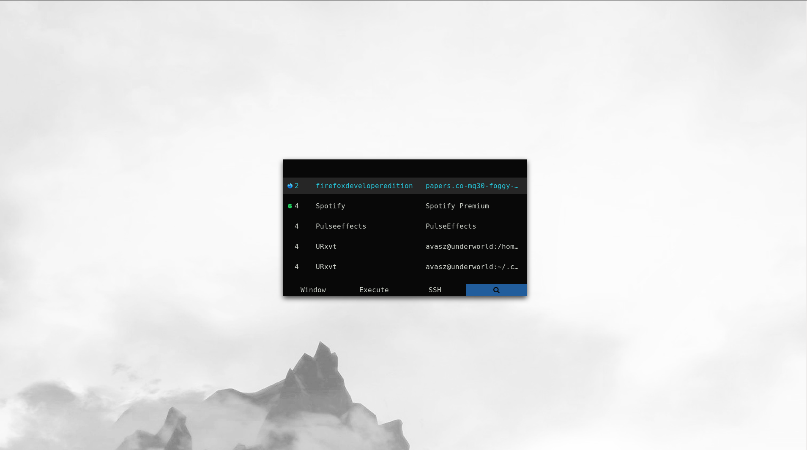
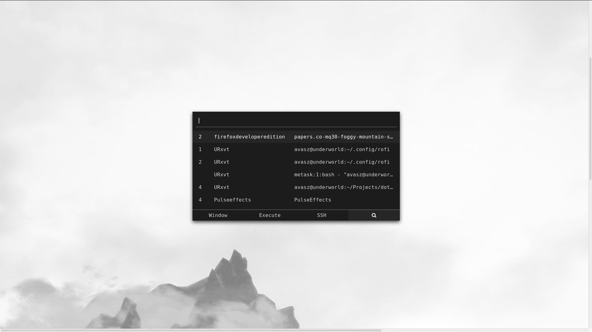
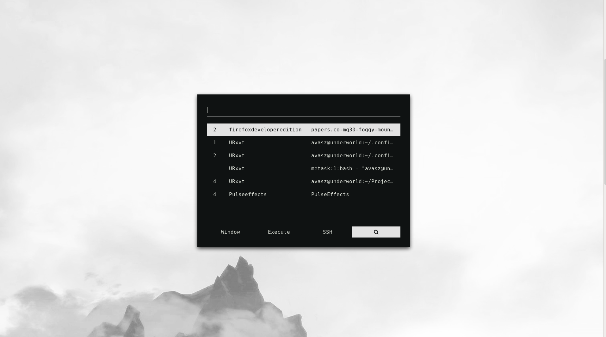

# Rofi themes - Avasz

[Rofi](https://github.com/davatorium/rofi) is a great tool with multiple functionality.  

Initially when I started using Rofi, I liked the functionalities it offered but never liked the default themes. I tried to change the themes but it failed miserably, so started to check for simplest themes and came across [Sidetab](https://github.com/davatorium/rofi-themes/blob/master/User%20Themes/sidetab.rasi) by 'deadguy'.  I liked the color schemes of this but didn't like that it was a sidebar, so started to modify this Sidetab, and named it "Darker Than Black".  

The v1 of Darker Than Black theme is result of the modification.

## 1. Darker Than Black

The name was inspired from the Anime with the same name. Recommended!  

### Darker Than Black - v1

Direct ripoff from **Deadguy's** [Sidetab](https://github.com/davatorium/rofi-themes/blob/master/User%20Themes/sidetab.rasi) theme.

[Config](darker-than-black/configs/darker-than-black_v1.rasi)

### Darker Than Black - v2

Slowly learnt the elements and items of rofi and started to customize the v1 after understanding various things.

[Config](darker-than-black/configs/darker-than-black_v2.rasi)

### Darker Than Black - v3

Saw a nice theme in [/r/unixporn](https://reddit.com/r/unixporn) and got inspired from the colorscheme used in it.

[Config](darker-than-black/configs/darker-than-black_v3.rasi)
